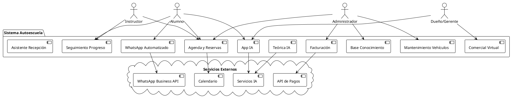
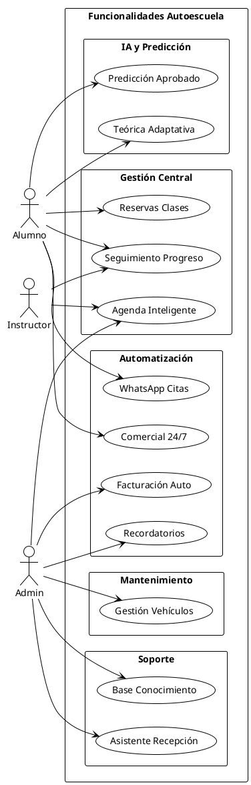
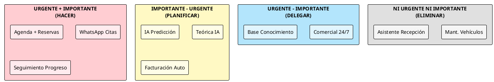
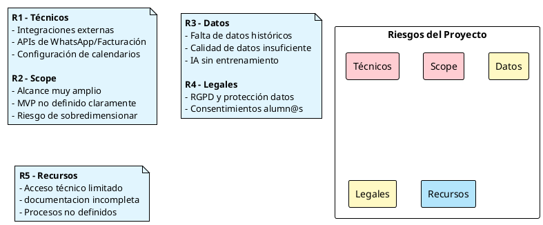
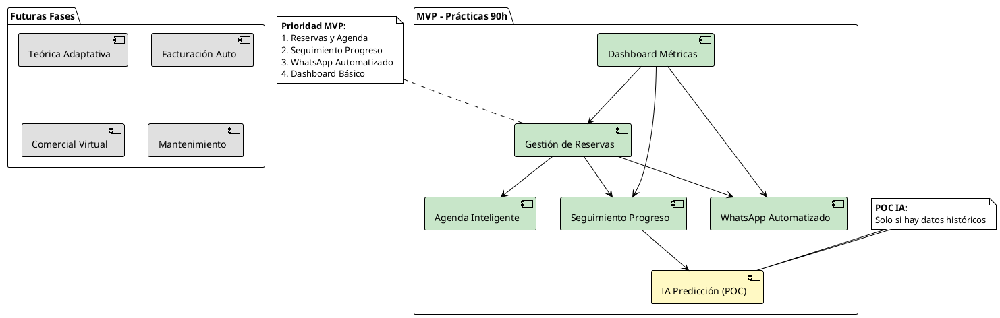
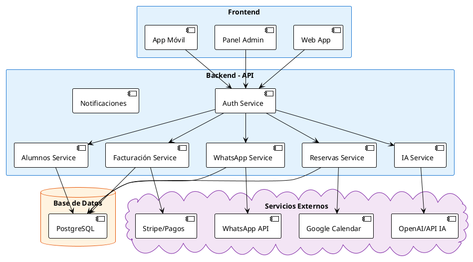
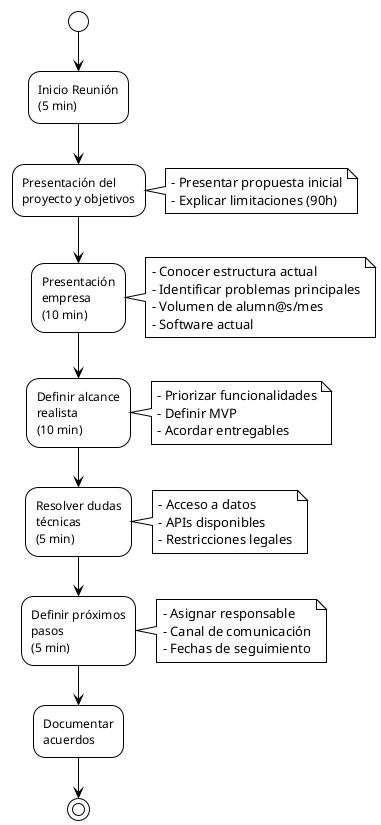
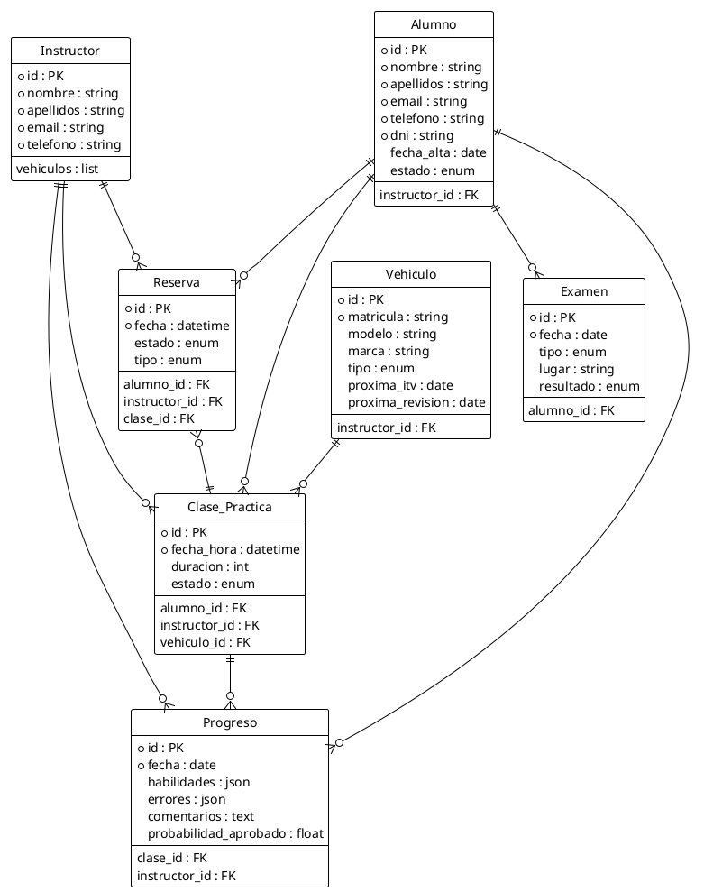

# Documento de Kick Off y Toma de Requisitos

**Proyecto:** Digitalización e Integración de IA para Autoescuela  
**Fecha:** Mayo 2026  
**Duración:** 90 horas (3 semanas)

---

## 1. Contexto del Proyecto

• La empresa desea modernizar varios procesos internos y de atención al alumno mediante automatización e inteligencia artificial.  
• El alcance inicial planteado es amplio y cubre múltiples áreas operativas de la autoescuela.  
• Due to the limited time of 90 hours of internships, it will be necessary to prioritize functionalities and possibly divide the project into phases or POCs.

---

## 2. Funcionalidades Propuestas Inicialmente

1. **Predicción mediante IA** - Probabilidad de aprobado/suspenso  
2. **Reservas de clases prácticas** - Seguimiento del progreso del alumno  
3. **Agenda inteligente** - Organización de horarios  
4. **Comercial virtual 24/7** - WhatsApp  
5. **Automatización de WhatsApp** - Para exámenes  
6. **Automatización de facturación**  
7. **Teórica personalizada** - IA adaptativa  
8. **Mantenimiento de vehículos** - ITV, revisiones  
9. **Base de conocimiento** - Atención al cliente  
10. **Asistente de recepción** - Primera atención  

---

## 3. Priorización para 90 Horas

| Prioridad | Funcionalidad | Justificación |
|-----------|---------------|----------------|
| **ALTA** | Agenda + Reservas | Impacto directo en operativa diaria, MVP funcional |
| **ALTA** | WhatsApp para citas | Rápida automatización con alto valor operativo |
| **ALTA** | Seguimiento de progreso | Base necesaria para futuras funcionalidades de IA |
| **MEDIA** | IA Predicción | Depende de datos históricos disponibles |
| **MEDIA** | Teórica adaptativa | Requiere banco de preguntas y más tiempo |
| **MEDIA** | Facturación | Útil, posiblemente dependent de software externo |
| **BAJA** | Comercial virtual 24/7 | Mayor complejidad técnica y coste externo |
| **BAJA** | Base de conocimiento | Propuesta futura |
| **BAJA** | Mantenimiento vehículos | Menos crítico para MVP inicial |

---

## 4. Problemas y Riesgos Detectados

- ⚠️ **Scope**: El alcance inicial es demasiado amplio para 90 horas
- ⚠️ **Integraciones**: WhatsApp Business API, facturación, calendarios
- ⚠️ **Datos IA**: Depende de datos históricos suficientes y estructurados
- ⚠️ **Documentación**: Posible falta de procesos internos definidos
- ⚠️ **Legales**: RGPD y tratamiento de datos personales
- ⚠️ **Riesgo**: Intentar implementar demasiado sin cerrar MVP funcional

---

## 5. Información Necesaria de la Empresa

1. ¿Qué funcionalidad consideran más importante?
2. ¿Qué problema les genera más pérdidas de tiempo?
3. ¿Qué software utilizan actualmente?
4. ¿Existen bases de datos históricas de alumnos?
5. ¿Cómo gestionan las clases prácticas y horarios?
6. ¿Volumen aproximado de alumnos al mes?
7. ¿Cuántos vehículos e instructores tienen?
8. ¿Utilizan WhatsApp Business?
9. ¿POC funcional o sistema completo?
10. ¿Qué es imprescindible para finalizar las prácticas?
11. ¿Quién validará avances?
12. ¿Qué acceso técnico podrán proporcionar?

---

## 6. Propuesta Realista de MVP

**Componentes del MVP:**
- ✅ Gestión de reservas y agenda inteligente
- ✅ Seguimiento básico de progreso del alumno
- ✅ Automatización de mensajes de WhatsApp
- ✅ Dashboard simple con métricas de alumnos

**POC IA:** Solo si existen datos suficientes

---

## 7. Objetivos de la Reunión de Kick Off (30 min)

1. ✅ Validar prioridades reales del negocio
2. ✅ Definir alcance realista para 90 horas
3. ✅ Confirmar acceso a datos y herramientas
4. ✅ Identificar restricciones técnicas y legales
5. ✅ Definir entregables mínimos esperados
6. ✅ Establecer responsables y método de comunicación

---

## 8. Diagramas del Proyecto

### 8.1 Diagrama de Contexto



### 8.2 Diagrama de Casos de Uso



### 8.3 Diagrama de Priorización (Eisenhower)



### 8.4 Diagrama de Riesgos



### 8.5 Diagrama de MVP Propuesto



### 8.6 Diagrama de Arquitectura



### 8.7 Diagrama de Flujo de Kick Off



### 8.8 Diagrama de Entidades (Base de Datos)



---

## 9. Conclusión

El proyecto tiene potencial para evolucionar hacia una plataforma integral para autoescuelas, pero para prácticas limitadas en tiempo es recomendable priorizar:

1. ✅ Automatización operativa (reservas, agenda, WhatsApp)
2. ✅ Gestión de alumnos
3. ✅ Seguimiento de progreso
4. 🔄 IA predictiva como POC (solo si hay datos)

Los sistemas avanzados de IA o asistentes virtuales complejos pueden dejarse para fases futuras.

---

## Archivos Generados

- `diagrama-contexto.puml` - Diagrama de contexto
- `diagrama-funcionalidades.puml` - Casos de uso
- `diagrama-priorizacion.puml` - Matriz Eisenhower
- `diagrama-riesgos.puml` - Riesgos identificados
- `diagrama-mvp.puml` - MVP propuesto
- `diagrama-arquitectura.puml` - Arquitectura del sistema
- `diagrama-kickoff.puml` - Flujo de reunión
- `diagrama-entidades.puml` - Modelo de datos
- `01-kickoff-toma-requisitos.md` - Este documento

**Para visualizar los diagramas:** Copia el código PlantUML en https://plantuml.com/plantuml

**Para generar imágenes localmente:** Instala Graphviz y ejecuta:
```bash
java -jar plantuml.jar -tpng *.puml
```